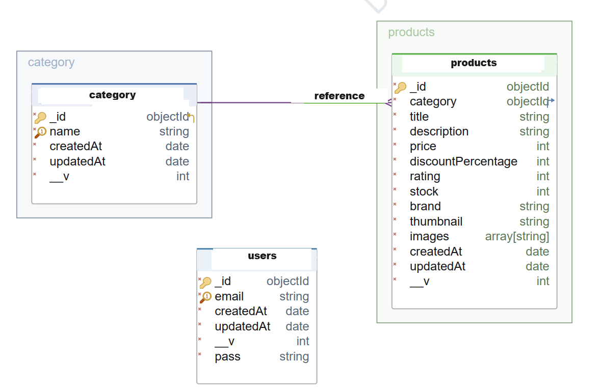

# Product API 2

This project is a RESTful API developed using Node.js and Express. The API interacts with a MongoDB database and is documented with Swagger. Once you perform the login process and obtain a token, you can access the products.

### ERD



## Table of Contents

- [Technologies Used](#technologies-used)
- [Documentation](#documentation)
- [Endpoints](#endpoints)
- [Project Skeleton](#project-skeleton)

## Live Demo

[Product API 2](https://product-api-2.vercel.app/)

## Technologies Used

- **Node.js**: An environment used for executing JavaScript.
- **Express**: A Node.js framework used for building web applications.
- **MongoDB**: A NoSQL database.
- **Mongoose**: An ODM (Object Data Modeling) library for MongoDB.
- **dotenv**: Used for managing environment variables.
- **swagger-autogen**: A tool used to automatically generate Swagger documents.
- **swagger-ui-express**: An interface for presenting Swagger documents in Express.
- **redoc-express**: An interface for presenting OpenAPI documents in Express.

### Documentation

- Swagger UI: [https://product-api-2.vercel.app/documents/swagger](https://product-api-2.vercel.app/documents/swagger)
- Redoc: [https://product-api-2.vercel.app/documents/redoc](https://product-api-2.vercel.app/documents/redoc)
- JSON Documentation: [https://product-api-2.vercel.app/documents/json](https://product-api-2.vercel.app/documents/json)

## Endpoints

### Users

- `GET /users`: Lists all users.
- `POST /users`: Creates a new user.
- `GET /users/:userId`: Displays a specific user.
- `PUT /users/:userId`: Updates information of a specific user.
- `DELETE /users/:userId`: Deletes a specific user.

### Authentication
- `POST /auth/login`: Provides user login.
- `GET /auth/logout`: Terminates the user session.

### Categories

- `GET /categories`: Lists all product categories.
- `POST /categories`: Creates a new product category.
- `GET /categories/:categoryId`: Displays a specific product category.
- `PUT /categories/:categoryId`: Updates information of a specific product category.
- `DELETE /categories/:categoryId`: Deletes a specific product category.

### Products

- `GET /products`: Lists all products.
- `POST /products`: Creates a new product.
- `GET /products/:productId`: Displays a specific product.
- `PUT /products/:productId`: Updates information of a specific product.
- `DELETE /products/:productId`: Deletes a specific product.

## Project Skeleton

```
Product API 2 (folder) 
│
├── src
│    ├── configs
│    │     ├── dbConnection.js
│    │     └── swagger.json
│    ├── controllers
│    │     ├── auth.js     
│    │     ├── category.js          
│    │     ├── product.js     
│    │     ├── token.js     
│    │     └── user.js
│    ├── helpers
│    │     ├── passwordEncrypt.js    
│    │     └── sync.js 
│    ├── middlewares 
│    │     ├── authentication.js 
│    │     ├── errorHandler.js 
│    │     ├── permissions.js   
│    │     └── queryHandler.js 
│    ├── models                    
│    │     ├── category.js         
│    │     ├── product.js     
│    │     ├── token.js     
│    │     └── user.js
│    └── routes                
│          ├── auth.js     
│          ├── category.js     
│          ├── document.js     
│          ├── index.js     
│          ├── product.js     
│          ├── token.js     
│          └── user.js
├── .gitignore
├── index.js
├── package-lock.json
├── package.json
├── swaggerAutogen.js
├── vercel.json
└── README.md
```